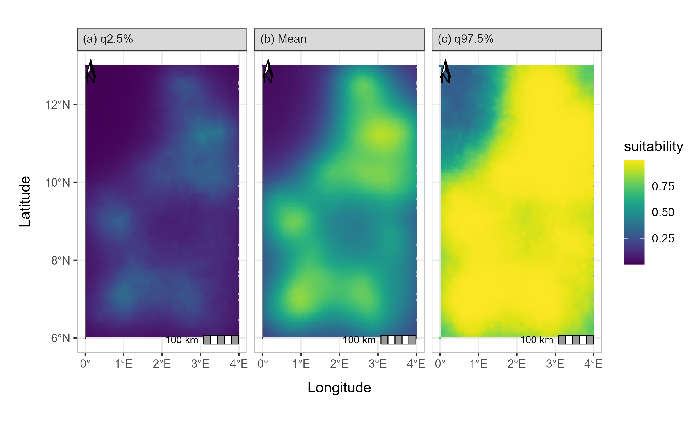

# isdmtools
`isdmtools` is an R package designed to streamline the process of preparing, evaluating and visualizing spatial data for biodiversity distribution modeling, with a specific focus on **integrated species distribution models (ISDMs)** with multisource geospatial datasets within a Bayesian framework. This includes presence-only, count and presence-absence data. It provides a set of tools for producing robust and reproducible workflows for block cross-validation, data management and visualization, and model evaluation, leveraging the power of `sf`, `dplyr`, `purrr`, and `ggplot2` packages.

# Installation

### How to install the package?
You can install the development version of `isdmtools` directly from GitHub using `devtools`.

```R
install.packages("devtools") 
devtools::install_github("sodeidelphonse/isdmtools")
```
### How can contributors manage the package dependencies?
This project uses `renv` to manage package dependencies and ensure reproducibility. To install all the necessary packages for this project, simply follow these steps:

- Make sure you have the `renv` package installed:

```R
install.packages("renv")
```

- With the project directory as your working directory, use `renv` to install all packages listed in the `renv.lock` file:

```R
renv::restore()
```

# Key Features
The package provides a set of core functions and classes to handle common tasks of data preparation, visualization and model evaluation:

**Data Preparation**: Create DataFolds objects that bind multiple `sf` datasets and generate spatially-separated cross-validation folds using the constructor function `create_folds()`. This ensures the resulting models are robust to spatial autocorrelation. The `fill_na_near()` function can be used to efficiently impute missing values in raster covariates for modelling tools that cannot handle missing values properly.

**Suitability Analysis**: Standardize model predictions for consistent mapping and compute a final habitat suitability index. The `suitability_index()` function transforms raw integrated model predictions into a suitability score using the inverse of the generalized complementary log-log transform (`cloglog`).

**Model Evaluation**: Compute comprehensive evaluation metrics, including ROC-based and continuous-outcome metrics for each dataset using the `compute_metrics()` function. The package also handles *dataset-weighted composite scores* (`"<METRIC>_Comp"`), providing a holistic view of model performance. Although, the `sample_bg_points()` constructor is called internally with the default random seeds to sample pseudo-absences for presence-only data, users can run it externally to store, print and visualize the points generated in the `BackgroundPoints` object.

**Mapping & Visualization**: Visualize model predictions and final habitat suitability maps. The plotting method `generate_maps()` is designed to provide a clear and informative map by visualizing multiple variables of model predictions (e.g. mean, median, standard deviation or quantiles), providing an easy way to interpret models' results. Users can customize the final `ggplot2` object if needed.

**S3 Methods**: The package includes `print()` and `plot()` methods for the `DataFolds` class, providing a concise summary and a clear visualization of the cross-validation partitions. 

# Getting Started: A Complete Worked Example
The core workflow of `isdmtools` involves creating a DataFolds object and then extracting specific folds for a modeling pipeline.

## Data preparation
First, let's load the package and create some dummy data for a hypothetical study region.

```R
library(isdmtools)
library(sf)
library(ggplot2)
library(dplyr)

# Set the random seed for reproducibility
set.seed(42)

# Presence-only data (e.g. Citizen science data)
presence_data <- data.frame(
  x = runif(100, 0, 4),
  y = runif(100, 6, 13),
) %>%
  st_as_sf(coords = c("x", "y"), crs = 4326)

# Count data (e.g. species count from a structured design)
count_data <- data.frame(
  x = runif(50, 0, 4),
  y = runif(50, 6, 13),
  count = rpois(50, 5)
) %>%
  st_as_sf(coords = c("x", "y"), crs = 4326)

# Create a list of datasets
datasets_list <- list(Presence = presence_data, Count = count_data)

# Define a dummy study region (e.g. Benin's minimum boundary rectangle)
ben_coords <- matrix(c(0, 6, 4, 6, 4, 13, 0, 13, 0, 6), ncol = 2, byrow = TRUE)
ben_sf <- st_sfc(st_polygon(list(ben_coords)), crs = 4326)
ben_sf <- st_sf(data.frame(name = "Region"), ben_sf)

# Create the DataFolds object
my_folds <- create_folds(datasets_list, ben_sf, k = 5, seed = 23)
print(my_folds)

# Visualize the folds
plot_cv <- plot(my_folds)
print(plot_cv)

# Extract a specific fold (e.g., Fold 3) for modeling and evaluation
splits_fold_3 <- extract_fold(my_folds, fold = 3)

# You can access both 'train' and "test" sets and their corresponding datasets
 train_data <- splits_fold_3$train
 test_data <- splits_fold_3$test
```
## Usage with Prediction Models
This first output above from the `isdmtools` package is a set of clean `sf` objects, which makes it easy to integrate with various spatial modeling tools using block cross-validation techniques. The extracted train and test data can be directly fed into your preferred modeling packages such as `inlabru`and `PointedSDMs` packages, 'MCMC' or any 'GLMs/GAMs' tools that can accommodate multisource spatial datasets. This ensures that your model predictions are validated using a robust spatial cross-validation approach and comprehensive evaluation metrics. 

### Step 1: Fitting a Bayesian spatial model with the `inlabru` package

The `inlabru` package is a wrapper for the `R-INLA` package which is designed for Bayesian Latent Gaussian Modelling using INLA (Integrated Laplace Nested Approximations) and Extensions. Let's develop a Bayesian model with the fake data above. We assume the following basic joint model with a shared latent signal $\xi(.)$ (i.e. a Gaussian random field):

$$
 \begin{matrix} 
 Y_{\mathrm{count},i}|\xi(.) \sim \mathrm{Pois} \left(\mu_i \right), \quad i = 1,\ldots,n,\\
 \log(\mu_i) = \beta_{0,\mathrm{count}} + \xi(\mathbf{s}_i)\\[3mm]
 X_{\mathrm{presence}}|\xi(.) \sim \mathrm{IPP} \left(\lambda(\mathbf{s}) \right),\\
\log (\lambda(\mathbf{s})) = \beta_{0,\mathrm{presence}} + \xi(\mathbf{s})\\
\end{matrix}\\
$$
where $\mathrm{IPP}$ means a _Inhomogeneous Poisson Process_ and $\mathbf{s}$ the vector of a location coordinates. 

```R
# The coordinates reference system (CRS) of the data
projection <- "+proj=longlat +ellps=WGS84 +datum=WGS84"
 
 if (requireNamespace("INLA", quietly = TRUE) &&
     requireNamespace("fmesher", quietly = TRUE) &&
     requireNamespace("inlabru", quietly = TRUE)) {

   # Create a "mesh" for the latent field 
   mesh <- fmesher::fm_mesh_2d(
     boundary = ben_sf,
     max.edge = c(0.3, 0.5),
     offset = c(1e-3, 0.8),
     cutoff = 0.12,
     crs = "epsg:4326"
   )
   
   # Visualize the mesh
   ggplot() + inlabru::gg(mesh)
   
   # Set the PC-prior for the SPDE model. We estimate a longer range value as no spatial 
   # autocorrelation was defined in the generated data:
   pcmatern <- INLA::inla.spde2.pcmatern(mesh,
                                       prior.range = c(2, 0.1), # P(spatial range < 2) = 0.1
                                       prior.sigma = c(1, 0.1)  # P(sigma > 1) = 0.1
              )
   
   # The shared spatial latent component is denoted by 'spde'
   jcmp <- ~ -1 + Presence_intercept(1) + Count_intercept(1) +
                  spde(geometry, model = pcmatern)
   
   # Count observation model
   lik_count <- inlabru::like(
     formula = count ~  + Count_intercept + spde,
     family = "poisson",
     data = train_data$Count
   )
   
   # Presence-only observation model (LGCP)
   lik_pp <- inlabru::like(
     formula = geometry ~ Presence_intercept + spde,
     family = "cp",
     data = train_data$Presence,
     domain = list(geometry = mesh),
     samplers = ben_sf
   )
   
   # Model fit
   jfit <- inlabru::bru(jcmp, lik_count, lik_pp,
                        options = list(control.inla = list(int.strategy = "eb"),
                                       bru_max_iter = 15)
                       )
 } else {
   message("'INLA', 'fmesher', and 'inlabru' is required to run this example.")
 }
 
 # Model results
 jfit$summary.fixed
 #>                     mean        sd        0.025quant  0.5quant 0.975quant   mode       kld
 #> Count_intercept    -1.04211843 0.6842276   -2.38318 -1.04211843   0.298943 -1.04211843   0
 #> Presence_intercept -0.05060088 0.6680780   -1.36001 -0.05060088   1.258808 -0.05060088   0
   
 jfit$summary.hyperpar
 #>                mean        sd      0.025quant 0.5quant  0.975quant  mode
 #> Range for spde 3.551056 1.2224526   1.836691  3.329475   6.578244  2.909072
 #> Stdev for spde 1.206941 0.3212041   0.711045  1.161888   1.966190  1.072183
 ```
As you can see, the estimated _spatial range_ is higher than we expected. This is because there is no spatial autocorrelation in the simulated data.
 
### Step 2: Model prediction 
 
 ```R
 # Define the predictions grids
 grids <- fmesher::fm_pixels(mesh, mask = ben_sf)
 
 # Joint habitat suitability (can exclude dataset-specific intercepts)
 jpred <- predict(jfit, newdata = grids, 
                formula = ~ spde + Presence_intercept + Count_intercept,
                n.samples = 500, seed = 24)
 jpred   <- prepare_predictions(jpred) 
   
 jt_prob <- suitability_index(jpred, 
                               post.stat = c("q0.025", "mean", "q0.975"), 
                               output.format = "prob",
                               response.type = "count",
                               projection = projection)
 plot(jt_prob)
   
 # Prediction of counts 
 jpred_count <- predict(jfit, newdata = grids, 
                    formula = ~ spde + Count_intercept ,
                    n.samples = 500, seed = 24)
 jpred_count <- prepare_predictions(jpred_count)
   
 jt_count <- suitability_index(jpred_count, 
                               post.stat = c("q0.025", "mean", "q0.975"), 
                               output.format = "response",
                               response.type = "count",
                               projection = projection)
 plot(jt_count)
 ```
### Step 3: Model Performance Evaluation using the test data

```R
 xy_observed <- rbind(st_coordinates(datasets_list$Presence)[, c("X","Y")], 
              st_coordinates(datasets_list$Count)[datasets_list$Count$count > 0, c("X","Y")])
   
 metrics <- c("auc", "tss", "accuracy", "rmse", "mae")
 eval_metrics <- compute_metrics(test_data, 
                                prob.raster = jt_prob$mean, 
                                xy.excluded = xy_observed, 
                                metrics = metrics,
                                overall.roc.metrics = c("auc", "tss", "accuracy"),
                                expected.response = jt_count,
                                responseCounts = "count"
                                )
metrics_result <- do.call(rbind, eval_metrics)
print(metrics_result)

                       [,1]
AUC_Presence      0.9051429
TSS_Presence      0.7335714
ACCURACY_Presence 0.8067061
RMSE_Presence            NA
MAE_Presence             NA
AUC_Count         0.8750000
TSS_Count         0.8750000
ACCURACY_Count    0.8888889
RMSE_Count        2.2168022
MAE_Count         1.8464205
AUC_Comp          0.8933478
TSS_Comp          0.7889130
ACCURACY_Comp     0.8388646
RMSE_Comp         2.2168022
MAE_Comp          1.8464205
TOT_ROC_SCORE     0.8403752
TOT_ERROR_SCORE   2.0316114

```
As you will have noticed, continuous-outcome metrics such as MAE (mean absolute error) and RMSE (root mean squared error) are not available for presence-only data, which makes sense.

### Step 4: Prediction mapping 
```R
p <- generate_maps(jt_prob, 
                   var.names = c("q0.025", "mean", "q0.975"), 
                   base.map = ben_sf,
                   legend.title = "suitability",  
                   panel.labels = c("(a) q2.5%", "(b) Mean", "(c) q97.5%"),
                   xaxis.breaks = seq(0, 4, 1),
                   yaxis.breaks = seq(6, 13, 2)
                   )
print(p)
```


Next, you can iterate through all five spatial folds to obtain an average model performance.
Finally, a model can be run on the entire 'datasets_list' to obtain the final prediction.
 
# Contributing
We welcome contributions! If you encounter an issue or have a feature request, please open an issue on the GitHub repository [here](https://github.com/sodeidelphonse/isdmtools/issues).

# Citation
To cite this package in your research work, run the following command in your R session to generate the plain text and `BiTex` entry of the citation:

```R
citation("isdmtools")
```
