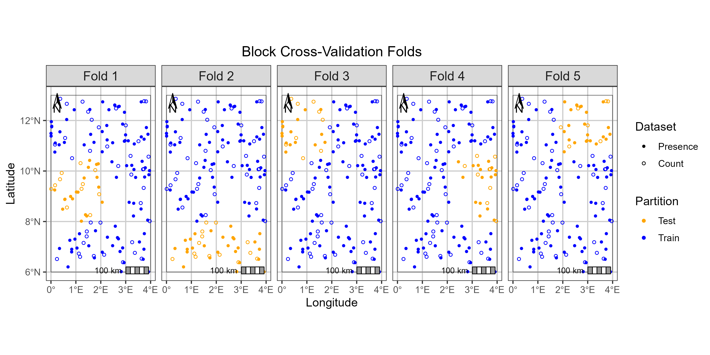

# isdmtools
<!-- badges: start -->
[](https://github.com/sodeidelphonse/isdmtools/actions/workflows/R-CMD-check.yaml) 
[](https://lifecycle.r-lib.org/articles/stages.html#experimental) 
[](https://app.codecov.io/gh/sodeidelphonse/isdmtools)
<!-- badges: end -->

`isdmtools` is an R package that streamlines the preparation, visualization, and evaluation of multisource geospatial data for biodiversity modeling.
Specifically engineered for *Integrated Species Distribution Models (ISDMs)* within a Bayesian framework, the package provides a unified suite for managing presence-only, count, and presence-absence data. 
It ensures robust, reproducible workflows through dedicated tools for block cross-validation, folds diagnostics and standardized model evaluation. 

# Installation

### How to install the package?
You can install the development version of `isdmtools` directly from GitHub using `devtools`.

```R
install.packages("devtools") 
devtools::install_github("sodeidelphonse/isdmtools")
```
### How can contributors manage the package dependencies?
This project uses `renv` to manage package dependencies and ensure reproducibility. To install all the necessary packages for this project, simply follow these steps:

- Make sure you have the `renv` package installed:

```R
install.packages("renv")
```

- With the project directory as your working directory, use `renv` to install all packages listed in the `renv.lock` file:

```R
renv::restore()
```

# Key Features
The package provides a set of core functions and classes to handle common tasks of data preparation, visualization and model evaluation:

**Data Preparation**: Create a `DataFolds` object that bind multiple `sf` datasets and generate spatially-separated cross-validation folds using the constructor function `create_folds()`. This ensures the resulting models are robust to spatial autocorrelation. 
The key methods `check_folds()` and `check_env_balance()` operate on `DataFolds` to efficiently check the independence and environmental balance of created folds, respectively. 

**Suitability Analysis**: Standardize model predictions for consistent mapping and compute a final habitat suitability index. The `suitability_index()` function transforms raw integrated model predictions into a suitability score using the inverse of the complementary log-log transform (`cloglog`).

**Model Evaluation**: Compute comprehensive evaluation metrics, including ROC-based and continuous-outcome metrics for each dataset (`"<METRIC>_DatasetName"`) using the `compute_metrics()` constructor. The package also handles *dataset-weighted composite scores* (`"<METRIC>_Comp"`), providing a holistic view of model performance. 
Note that the `sample_background()` constructor is called internally to sample pseudo-absences for presence-only data. However, users have the option of extracting the `BackgroundPoints` object with the `get_background()` helper in order to print and visualise the generated pseudo-absences.

**Mapping & Visualization**: Visualize model predictions and final habitat suitability maps. The plotting method `generate_maps()` is designed to provide a clear and informative map by visualizing multiple variables of model predictions (e.g. mean, and quantiles), providing an easy way to interpret models' results. 
Users can customize the final `ggplot2` object if needed.

**S3 Methods**: The package includes `summary()`, `print()` and `plot()` methods for different classes to provide a concise summary and a clear visualization of spatial data partition outputs, and evaluation metrics. Other methods are discussed in the package vignettes.

# How does it work?
The core workflow of `isdmtools` involves creating a `DataFolds` object and then extracting specific folds for a modeling pipeline.

### Data preparation
First, let's load the package and create some dummy data.

```r
library(isdmtools)
library(sf)
library(ggplot2)
library(dplyr)

# Set the random seed for reproducibility
set.seed(42)

# Presence-only data (e.g. Citizen science data)
presence_data <- data.frame(
  x = runif(100, 0, 4),
  y = runif(100, 6, 13),
) %>%
  st_as_sf(coords = c("x", "y"), crs = 4326)

# Count data (e.g. species count from a structured design)
count_data <- data.frame(
  x = runif(50, 0, 4),
  y = runif(50, 6, 13),
  count = rpois(50, 5)
) %>%
  st_as_sf(coords = c("x", "y"), crs = 4326)

# Create a list of datasets
datasets_list <- list(Presence = presence_data, Count = count_data)
```

### Spatial partitioning 
We can now create spatial folds using the default blocking engine.
```r
# Create the DataFolds object
my_folds <- create_folds(datasets_list, k = 5, seed = 23)
print(my_folds)

# Visualize the folds
plot(my_folds)

# Extract a specific fold (e.g., Fold 3) for modeling and evaluation
splits_fold_3 <- extract_fold(my_folds, fold = 3)

# You can access both 'train' and 'test' sets and their corresponding datasets
 train_data <- splits_fold_3$train
 test_data <- splits_fold_3$test
```


For a detailed introduction to the package, please see the [Get started](articles/isdmtools.html) guide.

# Contributing
We welcome contributions! If you encounter an issue or have a feature request, please open an issue on the GitHub repository [here](https://github.com/sodeidelphonse/isdmtools/issues).

# Citation
To cite this package in your research work, run the following command in your R session to generate the plain text and `BiTex` entry of the citation:

```R
citation("isdmtools")
```
