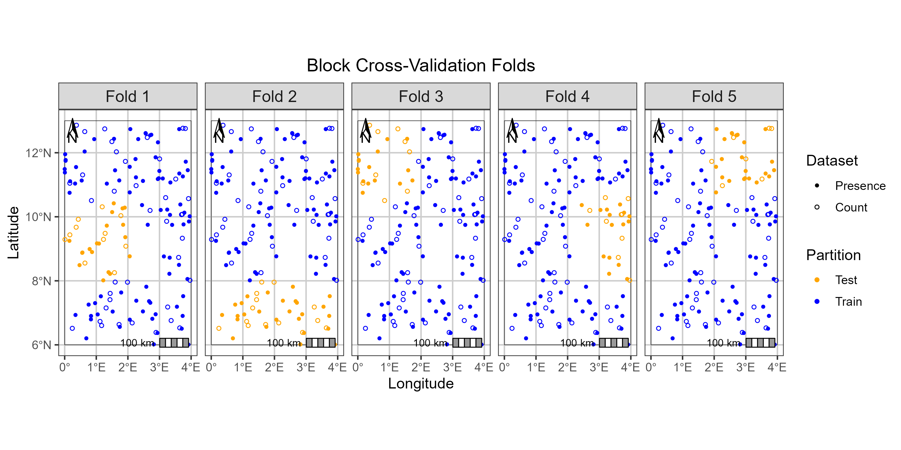

# isdmtools
<!-- badges: start -->
[](https://github.com/sodeidelphonse/isdmtools/actions/workflows/R-CMD-check) 
[](https://github.com/sodeidelphonse/isdmtools/actions/workflows/lint)
[](https://www.repostatus.org/#active)
[](https://lifecycle.r-lib.org/articles/stages.html#maturing) 
[](https://app.codecov.io/gh/sodeidelphonse/isdmtools)
[](https://github.com/sodeidelphonse/isdmtools/releases)
[](https://github.com/sodeidelphonse/isdmtools/stargazers)
[](https://opensource.org/licenses/MIT)

<!-- badges: end -->

## Table of contents
* [Overview](#overview)
* [Installation](#installation)
* [Core Features](#core-features)
* [Usage Example](#usage-example)
* [Contributing](#contributing)
* [Citation](#citation)
* [License](#license)

## Overview
`isdmtools` is an R package that streamlines the preparation, visualization, and evaluation of multisource geospatial data for biodiversity modeling.
Specifically engineered for *Integrated Species Distribution Models (ISDMs)* with a particular focus on the Bayesian framework, 
the package provides a unified suite of tools for managing presence-only, count, and presence-absence data. 
It ensures robust, reproducible workflows through dedicated tools for block cross-validation, suitability analysis and standardized model evaluation. 

## Installation

1. You can install the latest development version of `isdmtools` directly from GitHub using the `remotes` package.

```R
if (!require("remotes")) install.packages("remotes") 
remotes::install_github("sodeidelphonse/isdmtools")
```
2. Alternatively, if you are on Windows operating system and don't have `Rtools` installed due to restricted internet access, 
you can download the binary build from our latest [GitHub Releases](https://github.com/sodeidelphonse/isdmtools/releases) and then install it with:

```R
install.packages("C:/path/to/your/download/isdmtools_<version>.zip", repos = NULL, type = "win.binary")
```
where `<version>` is the version number (e.g., v0.4.0) of the release you downloaded and `{C:/path/to/your/download/}` is the path to the binary `".zip"` file.

3. For MacOS or other platforms (Linux), you must compile the source code (`"isdmtools_<version>.tar.gz"`) available from our latest [GitHub Releases](https://github.com/sodeidelphonse/isdmtools/releases).
Download the desired version and then install it with:

```R
install.packages("/path/to/your/download/isdmtools_<version>.tar.gz", repos = NULL, type = "source")
```
where `<version>` is the version number of the release you downloaded and `{/path/to/your/download/}` is the path to the `".tar.gz"` file.

## Core Features
The package provides a set of core functions and classes to handle common tasks of data preparation, visualization and model evaluation:

- **Resampling and Folds Diagnostics**: Create a `DataFolds` object that bind multiple `sf` datasets and generate spatially-separated cross-validation folds using `create_folds()` constructor. 
This ensures the resulting models are robust to spatial autocorrelation. 
The key methods `check_folds()` and `check_env_balance()` operate on `DataFolds` to efficiently check the independence and environmental balance of created folds, respectively. 

- **Suitability Analysis**: Standardize model predictions for consistent mapping and compute a final habitat suitability index. 
The `suitability_index()` function transforms raw integrated model predictions into a suitability score using the inverse of the complementary log-log transform (`cloglog`).

- **Model Evaluation**: Compute comprehensive evaluation metrics, including ROC-based and continuous-outcome metrics for each dataset using the `compute_metrics()` constructor. 
The package also handles *dataset-weighted composite scores*, providing a holistic view of model performance. Note that `sample_background()` is called internally to sample pseudo-absences for presence-only data. 
However, users can extract the `BackgroundPoints` object with the `get_background()` helper in order to visualize the generated pseudo-absences.

- **Mapping & Visualization**: Visualize model predictions and final habitat suitability maps. 
The plotting method `generate_maps()` is designed to receive a formatted object from `format_predictions()` to provide a clear and informative map. 
It visualizes multiple variables of model predictions (e.g. mean, SD, and quantiles), providing an easy way to interpret models' results. 
Users can customize the final `ggplot2` object if needed.

- **Statistical Validation**: `simulate_replicates()` generate replicates of data ($y_{rep}$) from the posterior samples of the fitted model.
`compute_ppc_stats()` calculates Pearson Chi-squared statistics and Bayesian $p$-values from the replicated data to assess model fit.

- **Other Methods**: The package includes the `summary()`, `print()` and `plot()` methods for most of the available data structures. 
These provide a concise summary and clear visualization of spatial data partition, folds' diagnostics, and models' evaluation and validation. 
Other methods are discussed in the package vignettes.

## Usage Example
The core workflow of `isdmtools` involves creating a `DataFolds` object and then extracting specific folds for a modeling pipeline.

### Data preparation
First, let's load the package and create some dummy data.

```r
library(isdmtools)
library(sf)
library(ggplot2)
library(dplyr)

# Set the random seed for reproducibility
set.seed(42)

# Presence-only data (e.g. Citizen science data)
presence_data <- data.frame(
  x = runif(100, 0, 4),
  y = runif(100, 6, 13),
) |>
  st_as_sf(coords = c("x", "y"), crs = 4326)

# Count data (e.g. species count from a structured design)
count_data <- data.frame(
  x = runif(50, 0, 4),
  y = runif(50, 6, 13),
  count = rpois(50, 5)
) |>
  st_as_sf(coords = c("x", "y"), crs = 4326)

# Create a list of datasets
datasets_list <- list(Presence = presence_data, Count = count_data)
```

### Spatial partitioning 
We can now create spatial folds using the default blocking engine.
```r
# Create the DataFolds object
my_folds <- create_folds(datasets_list, k = 5, seed = 23)
print(my_folds)

# Visualize the folds
plot(my_folds)
```


### Extract folds for an integrated modeling workflow
One can extract a specific fold to evaluate the integrated model and keep the remaining folds for its training.
```r
# Extract the fold 3 for model evaluation
splits_fold_3 <- extaract_fold(my_folds, fold = 3)

# You can access both 'train' and 'test' sets and their corresponding datasets
 train_data <- splits_fold_3$train
 test_data <- splits_fold_3$test
```

### Folds diagnostics
You can check spatial independence of folds using `check_folds`.
```r
# Check spatial independence of folds using the default range rho (N/A)
geo_diag <- check_folds(folds, plot = TRUE)
print(geo_diag)
plot(geo_diag)
```

For a detailed introduction to the package, please see the [Get started](articles/isdmtools.html) guide.

## Contributing
* We welcome contributions! If you encounter an issue or have a feature request, please open an issue on the GitHub repository [here](https://github.com/sodeidelphonse/isdmtools/issues).

* This project uses `renv` to manage package dependencies and ensure reproducibility. 
A contributor who wants to install all the necessary packages for this project can simply follow these steps:

  - Make sure you have the `renv` package installed:

  ```R
  install.packages("renv")
  ```
  - With the project directory as your working directory, use `renv` to install all packages listed in the `renv.lock` file:

  ```R
  renv::restore()
  ```

* Please note that the `isdmtools` project is released with a [Contributor Code of Conduct](https://www.contributor-covenant.org/version/2/1/code_of_conduct/code_of_conduct.md). 
By contributing to this project, you agree to abide by its terms.

## Citation
To cite this package in your research work, run the following command in your R session to generate the plain text and `BiTex` entry of the citation:

```R
citation("isdmtools")
```

## License
The `isdmtools` package is released under the [MIT License](LICENSE).
