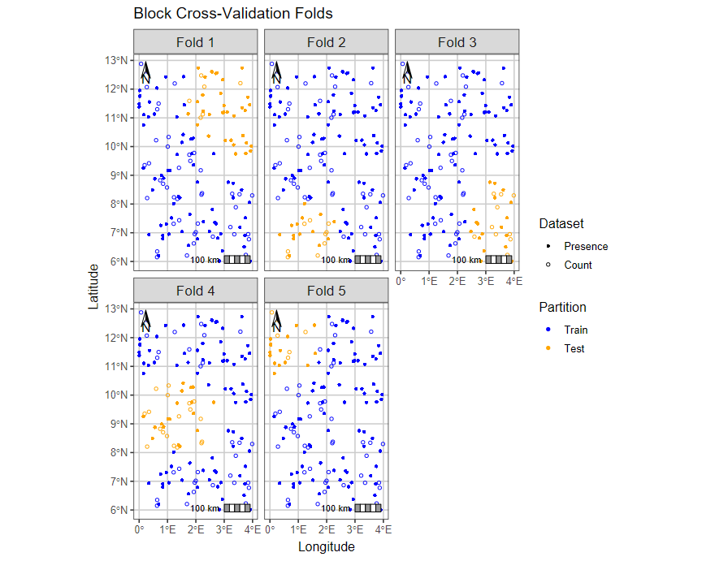
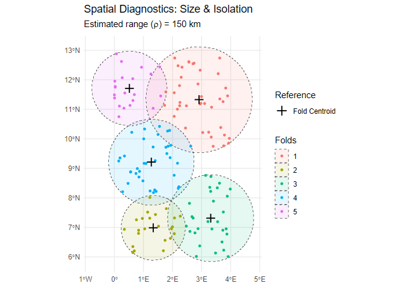

<!-- README.md is generated from README.Rmd. Please edit that file -->

# isdmtools

<!-- badges: start -->

[](https://github.com/sodeidelphonse/isdmtools/actions/workflows/R-CMD-check)
[](https://github.com/sodeidelphonse/isdmtools/actions/workflows/lint)
[](https://www.repostatus.org/#active)
[](https://lifecycle.r-lib.org/articles/stages.html#maturing)
[](https://app.codecov.io/gh/sodeidelphonse/isdmtools)
[](https://github.com/sodeidelphonse/isdmtools/releases)
[](https://github.com/sodeidelphonse/isdmtools/stargazers)
[](https://opensource.org/licenses/MIT)

<!-- badges: end -->

## Table of contents

- [Overview](#overview)
- [Installation](#installation)
- [Core Features](#core-features)
- [Usage Example](#usage-example)
- [Contributing](#contributing)
- [Citation](#citation)
- [License](#license)

## 📋 Overview

`isdmtools` is an R package that streamlines the preparation,
visualisation, and evaluation of multisource geospatial data for
biodiversity modelling. Specifically engineered for *Integrated Species
Distribution Models (ISDMs)* with a particular focus on the Bayesian
framework, the package provides a unified suite of tools for managing
presence-only, count, and presence-absence data. It ensures robust,
reproducible workflows through dedicated tools for block
cross-validation, suitability analysis and standardised model evaluation
and validation.

## 📦 Installation

- You can install the latest development version of `isdmtools` directly
  from GitHub using the `remotes` package.

``` r
if (!require("remotes")) install.packages("remotes") 
remotes::install_github("sodeidelphonse/isdmtools")
```

- Alternatively, if you are on a Windows operating system and don’t have
  `Rtools` installed due to restricted internet access, you can download
  the binary build from our latest [GitHub
  Releases](https://github.com/sodeidelphonse/isdmtools/releases) and
  then install it with:

``` r
install.packages("C:/path/to/your/download/isdmtools_<version>.zip", repos = NULL, type = "win.binary")
```

where `<version>` is the version number (e.g., v0.4.0) of the release
you downloaded and `{C:/path/to/your/download/}` is the path to the
binary `".zip"` file.

- For macOS or Linux platforms, you must compile the source code
  (`"isdmtools_<version>.tar.gz"`) available from our latest [GitHub
  Releases](https://github.com/sodeidelphonse/isdmtools/releases).
  Download the desired version and then install it with:

``` r
install.packages("/path/to/your/download/isdmtools_<version>.tar.gz", repos = NULL, type = "source")
```

where `<version>` is the version number of the release you downloaded
and `{/path/to/your/download/}` is the path to the `".tar.gz"` file.

## 🛠️ Core Features

The package provides a set of core functions and classes to handle
common tasks of data preparation, visualisation, post-modelling
analysis, and model evaluation:

- **Spatial Resampling and Folds Diagnostics**: Create a `DataFolds`
  object that binds multiple `sf` datasets and generates
  spatially-separated cross-validation folds using `create_folds()`
  constructor. This ensures the resulting models are robust to spatial
  autocorrelation. The key methods `check_folds()` and
  `check_env_balance()` operate on `DataFolds` to efficiently check the
  independence and environmental balance of created folds, respectively.

- **Suitability Analysis**: Standardise model predictions for consistent
  mapping and compute a final habitat suitability index. The
  `suitability_index()` function transforms raw integrated model
  predictions into a suitability score using the inverse of the
  complementary log-log transform (`cloglog`).

- **Model Evaluation**: Compute comprehensive evaluation metrics,
  including ROC- and error-based metrics for each dataset using the
  `compute_metrics()` constructor. The package also handles
  *dataset-weighted composite scores*, providing a holistic view of
  model performance. Whilst `sample_background()` is called internally
  to sample pseudo-absences for presence-only data, users can extract
  the `BackgroundPoints` object with the `get_background()` helper in
  order to visualise the generated pseudo-absences.

- **Mapping**: Visualise model predictions and final habitat suitability
  maps. The plotting method `generate_maps()` is designed to receive a
  formatted object from `format_predictions()` to provide a clear and
  informative map. It visualises multiple variables of model predictions
  (e.g. mean, SD, and quantiles), providing an easy way to interpret
  models’ results. Users can customize the final `ggplot2` object if
  needed.

- **Statistical Validation**: `simulate_replicates()` generate
  replicates of data ($y_{rep}$) from the posterior samples of the
  fitted model. `compute_ppc_stats()` calculates Pearson Chi-squared
  statistics and Bayesian $p$-values from the replicated data to assess
  the model fit.

- **Other Methods**: The package includes the `summary()`, `print()` and
  `plot()` methods for most of the available data structures. These
  provide a concise summary and clear visualisation of spatial data
  partition, folds’ diagnostics, and models’ validation. Other methods
  are discussed in the package vignettes.

## 💻 Usage Example

The core workflow of `isdmtools` involves creating a `DataFolds` object
and then extracting specific folds for an integrated modelling pipeline.

### Data preparation

First, let’s load the required packages.

``` r
library(isdmtools)
library(sf)
library(ggplot2)
library(dplyr)
```

We create some dummy data.

``` r
# Set the random seed for reproducibility
set.seed(42)

# Presence-only data (e.g. Citizen science data)
presence_data <- data.frame(
  x = runif(100, 0, 4),
  y = runif(100, 6, 13)
) |>
  st_as_sf(coords = c("x", "y"), crs = 4326)

# Count data (e.g. species count from a structured design)
count_data <- data.frame(
  x = runif(50, 0, 4),
  y = runif(50, 6, 13),
  count = rpois(50, 5)
) |>
  st_as_sf(coords = c("x", "y"), crs = 4326)

# Create a list of datasets
datasets_list <- list(Presence = presence_data, Count = count_data)
```

### Spatial partitioning

We can now create spatial folds using the default blocking engine.

``` r
# Create the 'DataFolds' object
my_folds <- create_folds(datasets_list, k = 5, seed = 23)
#>   train test
#> 1   110   40
#> 2   127   23
#> 3   121   29
#> 4   113   37
#> 5   129   21
print(my_folds)
#> A DataFolds S3 object with 5 folds.
#> Datasets included: Presence, Count 
#> 
#> Summary of individuals per dataset:
#> Simple feature collection with 10 features and 3 fields
#> Geometry type: MULTIPOINT
#> Dimension:     XY
#> Bounding box:  xmin: 0.0009555863 ymin: 6.009666 xmax: 3.986211 ymax: 12.87862
#> Geodetic CRS:  WGS 84
#> # A tibble: 10 × 4
#>    datasetName folds_ids     n                                          geometry
#>    <fct>           <int> <int>                                  <MULTIPOINT [°]>
#>  1 Presence            1    34 ((2.447115 10.36529), (3.038177 10.21236), (3.33…
#>  2 Presence            2    14 ((0.6850573 6.203601), (1.518237 7.039126), (1.7…
#>  3 Presence            3    18 ((2.582528 7.814824), (3.312634 8.219373), (3.13…
#>  4 Presence            4    19 ((1.085146 9.163205), (1.021715 9.169121), (0.86…
#>  5 Presence            5    15 ((1.560814 12.43443), (1.333709 11.03565), (1.59…
#>  6 Count               1     6 ((3.570874 12.20728), (2.189704 12.47532), (2.29…
#>  7 Count               2     9 ((0.6315204 6.150152), (0.6360895 6.349245), (1.…
#>  8 Count               3    11 ((3.407724 7.888013), (3.540471 8.339619), (3.28…
#>  9 Count               4    18 ((0.2828876 8.206826), (0.7418143 8.82648), (0.8…
#> 10 Count               5     6 ((1.254735 12.19655), (0.6865285 11.49745), (0.6…
```

We can visualise folds created with the observed data

``` r
# Visualise the block CV folds
plot(my_folds, nrow = 2)
```



### Extract folds for an integrated modelling workflow

One can extract a specific fold to evaluate the integrated model and
keep the remaining folds for its training.

``` r
# Extract the fold 3 for model evaluation
splits_fold_3 <- extract_fold(my_folds, fold = 3)

# You can access both 'train' and 'test' sets and their corresponding datasets
 train_data <- splits_fold_3$train
 test_data <- splits_fold_3$test
```

### Folds diagnostics

You can check the spatial independence of folds using `check_folds`
command.

``` r
# Check spatial independence of folds using an estimated range rho (150 km)
geo_diag <- check_folds(my_folds, rho = 150, plot = TRUE)
print(geo_diag)
#> 
#> === isdmtools: Spatial Fold Diagnostic ===
#> Model Spatial Range (rho): 150 km
#> 
#>         independence Count
#> 1 Weakly Independent     5
#> 
#> Internal Size (Max Distance to Fold Centroid):
#>    Min. 1st Qu.  Median    Mean 3rd Qu.    Max. 
#>   121.1   139.3   160.4   156.3   162.3   198.2 
#> 
#> Inter-block Gap (Min Distance to Nearest Fold):
#>    Min. 1st Qu.  Median    Mean 3rd Qu.    Max. 
#>   22.75   22.75   24.62   27.72   24.62   43.87 
#> ==========================================
```

``` r
# Plot the diagnostics results
plot(geo_diag)
```



### To Learn More

For a comprehensive overview of spatial data resampling, please refer to
the [Get
started](https://sodeidelphonse.github.io/isdmtools/isdmtools.html)
guide. To dive deep into the integrated modelling workflow, please,
consult the advanced guide on the [ISDM Evaluation
Workflow](https://sodeidelphonse.github.io/isdmtools/isdm-workflow.html).

## 🤝 Contributing

We welcome contributions! If you encounter an issue or have a feature
request, please open an issue via our GitHub repository [issue
tracker](https://github.com/sodeidelphonse/isdmtools/issues). We present
below our contribution guide:

- **Code of Conduct**: The `isdmtools` project is released with a
  [Contributor Code of
  Conduct](https://www.contributor-covenant.org/version/2/1/code_of_conduct/code_of_conduct.md).
  By contributing to this project, you agree to abide by its terms.

- **How to Help**: Before submitting a **Pull Request**, please open an
  issue via our [issue
  tracker](https://github.com/sodeidelphonse/isdmtools/issues) so we can
  discuss the proposed changes.

- **Coding Style**: We follow the `tidyverse` style guide and we
  recommend you to run `lintr::lint_package()` before submitting code.
  Please, minimise the use of additional package dependencies when
  proposing changes.

- **Virtual Environment**: This project uses `renv` to manage package
  dependencies and ensure reproducibility. A contributor who wants to
  install all the necessary packages for the project can simply follow
  these steps:

  - Make sure you have the `renv` package installed:

  ``` r
  install.packages("renv")
  ```

  - With the project directory as your working directory, use `renv` to
    install all packages listed in the `renv.lock` file:

  ``` r
  renv::restore()
  ```

## 📝 Citation

To cite this package in your research work, run the following command in
your R session to generate the plain text and `BibTex` entry of the
citation:

``` r
citation("isdmtools")
```

## ⚖️ License

The `isdmtools` package is released under the [MIT License](LICENSE).
