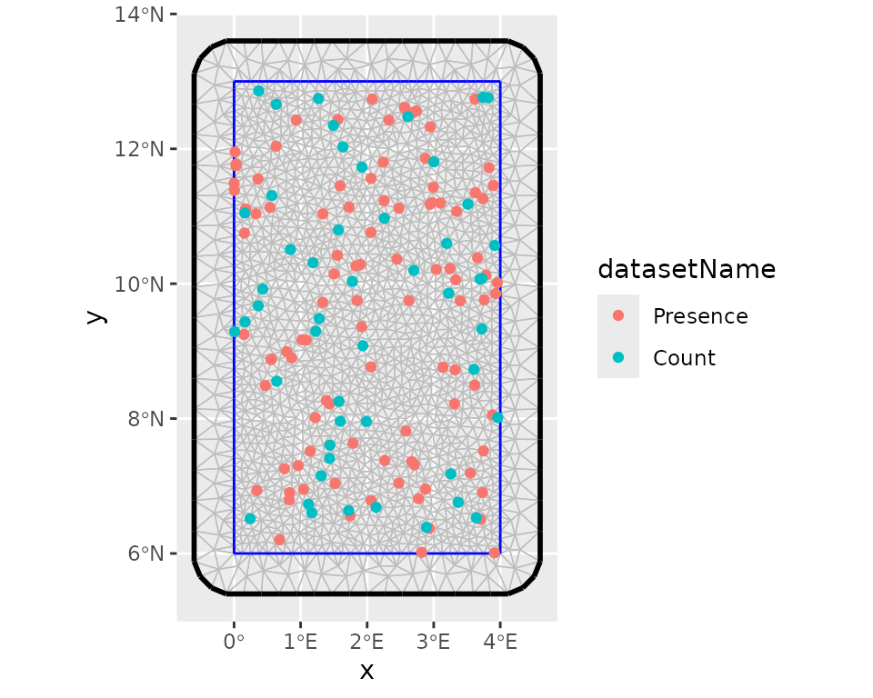

# ISDM Evaluation Workflow

``` r
library(isdmtools)
library(sf)
library(terra)
library(fmesher)
library(ggplot2)
library(inlabru)
# library(INLA)  # required
```

## Introduction

Model-based data integration in the context of species distribution
modeling (SDM) is any statistical approach that combine biodiversity
data from different sampling schemes (see [Isaac et
al. 2020](https://sodeidelphonse.github.io/isdmtools/articles/10.1016/j.tree.2019.08.006)
for an overview). The purpose is to correct for certain biases in the
primary data, or providing an overall estimation of species distribution
based on multisource spatial information. A popular integration strategy
is the joint analysis of presence-only (PO) observations which are
generally available as citizen science data and abundance observations
which are often collected through structured sampling protocols. The
primary objective of `isdmtools` package is to provide a comprehensive
and robust framework for data integration in SDM.

As demonstrated in the [Get
started](https://sodeidelphonse.github.io/isdmtools/articles/isdmtools.md)
guide, the first output from the `isdmtools` package is a set of clean
`sf` objects, which makes it easy to integrate with various spatial
modeling tools using block cross-validation techniques. The extracted
training and testing data can be directly fed into your preferred
integrated modeling tools such as `inlabru`, `PointedSDMs`, or any
GLMMs/GAMMs tools that can accommodate multisource spatial data. This
ensures that your model predictions are validated using a robust spatial
cross-validation approach and comprehensive evaluation metrics.

This vignette shows step by step how the `isdmtools` can be used with
other predictive modelling tools such as `inlabru` for a complete
workflow of integrated species distribution modelling (ISDM) analysis.

## Data preparation

In this section, we will be looking at the simulated datasets that were
presented in the previous tutorials. These can be obtained using the
code snippet below. The objective is to implement an integrated model
for the joint analysis of both data.

``` r
# Simulate a list of presence-only and count data
set.seed(42)
presence_data <- data.frame(
  x = runif(100, 0, 4),
  y = runif(100, 6, 13),
  site = rbinom(100, 1, 0.6)
) |> st_as_sf(coords = c("x", "y"), crs = 4326)

count_data <- data.frame(
  x = runif(50, 0, 4),
  y = runif(50, 6, 13),
  count = rpois(50, 5)
) |> st_as_sf(coords = c("x", "y"), crs = 4326)

datasets_list <- list(Presence = presence_data, Count = count_data)
```

Prior to data partitioning and *fold diagnostics*, it is recommended
that the study region be defined as an ‘sf’ polygon. This polygon should
have the same coordinate reference system (CRS) as the data. This will
ensure that it is suitable for the visualisation of spatial folds and
the model fitting processes.

``` r
# Define the study region (e.g. Benin's boundary rectangle)
ben_coords <- matrix(c(0, 6, 4, 6, 4, 13, 0, 13, 0, 6), ncol = 2, byrow = TRUE)
ben_sf <- st_sf(
  data.frame(name = "Region"),
  st_sfc(st_polygon(list(ben_coords)), crs = "epsg:4326")
)
```

Now, we can partition the datasets using the clustering blocking scheme
for blocked cross-validation.

``` r
# Create spatial folds
folds <- create_folds(datasets_list, ben_sf, cv_method = "cluster")
#>   train test
#> 1   120   30
#> 2   110   40
#> 3   125   25
#> 4   125   25
#> 5   120   30

# Extract the train/test for the third Fold
train_data <- extract_fold(folds, fold = 3)$train
test_data <- extract_fold(folds, fold = 3)$test
```

## Fitting an integrated model with `inlabru`

The `inlabru` package (Bachl et al. 2019) is a wrapper for `R-INLA`
(Rue, Martino, and Chopin 2009) which is designed for Bayesian Latent
Gaussian Modelling using Integrated Laplace Nested Approximations (INLA)
and Extensions. Let us develop a Bayesian spatial model with the
resampled data above for cross-validation.

### Step 1: Model definition

We assume the following basic joint model with a shared latent signal
$\xi(.)$ represented by a Gaussian random field with a *Matern*
correlation function:

$$\begin{array}{rlrlr}
 & {Y_{\text{count},i}|\xi(.)} & & {\sim \text{Pois}\left( \mu_{i} \right),} & {i = 1,\ldots,n} \\
 & {\log\left( \mu_{i} \right)} & & {= \beta_{0,\text{count}} + \xi\left( \mathbf{s}_{i} \right)} & \\
 & {X_{\text{presence}}|\xi(.)} & & {\sim \text{IPP}\left( \lambda(\mathbf{s}) \right),} & \\
 & {\log\left( \lambda(\mathbf{s}) \right)} & & {= \beta_{0,\text{presence}} + \xi(\mathbf{s}),} & \\
 & & & & 
\end{array}$$ where $IPP$ means a *Inhomogeneous Poisson Process* and
$\mathbf{s}$ the vector of a location coordinates. The IPP model
presented here is known in spatial statistics as a log-Gaussian Cox
process model - LGCP (see, Møller, Syversveen, and Waagepetersen
(1998)). Although the large-scale component which includes the
data-specific intercept can also incorporate environmental covariates,
we assume that the basic joint model above is valid for the data.
Alternative specifications of data fusion model have been discussed in
Sode et al. (2025).

### Step 2: Model implementation

One can now prepare the remaining data required to fit an integrated
model. First, we set up the mesh to be used for approximating the latent
field as well as for the integration points in the LGCP likelihood.

``` r
# Create a "mesh" for the latent field
mesh <- fmesher::fm_mesh_2d(
  boundary = ben_sf,
  max.edge = c(0.2, 0.5),
  offset = c(1e-3, 0.6),
  cutoff = 0.10,
  crs = "epsg:4326"
)

# Visualise the whole data points with the mesh
ggplot() +
  inlabru::gg(mesh) +
  gg(folds$data_all, aes(color = datasetName))
```



After this step, we can define the prior distributions for the
hyperparameters of the latent component such as the range and the
marginal standard deviation, keeping default prior (i.e. Gaussian
distribution with precision 0.001) for the intercepts. we use the
penalized model component complexity priors (see Simpson et al. (2017)
for more details). Then we define the observation model for each data
type and fuse them using a joint likelihood estimation with INLA and
SPDE techniques (Simpson et al. 2016).

``` r
# Set the PC-prior for the SPDE model. We estimate a longer range value as no spatial
# autocorrelation was defined in the data generation process:
pcmatern <- INLA::inla.spde2.pcmatern(mesh,
  prior.range = c(1, 0.1), # Prob(spatial range < 1) = 0.1
  prior.sigma = c(1, 0.1) # Prob(sigma > 1) = 0.1
)

# The shared spatial latent component is denoted by 'spde'
jcmp <- ~ -1 + Presence_intercept(1) + Count_intercept(1) +
  spde(geometry, model = pcmatern)

# Count observation model
obs_model_count <- inlabru::bru_obs(
  formula = count ~ +Count_intercept + spde,
  family = "poisson",
  data = train_data$Count
)

# Presence-only observation model (LGCP)
obs_model_pres <- inlabru::bru_obs(
  formula = geometry ~ Presence_intercept + spde,
  family = "cp",
  data = train_data$Presence,
  domain = list(geometry = mesh),
  samplers = list(geometry = ben_sf)
)

# Model fit
jfit <- inlabru::bru(jcmp, obs_model_count, obs_model_pres,
  options = list(
    control.inla = list(int.strategy = "eb"),
    bru_max_iter = 20
  )
)
```

We can collect model results after the process of model fitting. As
expected, the estimated *spatial range* is higher than 1. This is
because there is no strong spatial autocorrelation in the simulated
data.

``` r
jfit$summary.fixed
#>                     mean        sd      0.025quant  0.5quant   0.975quant  mode      kld
#> Count_intercept    -0.2497590 0.3086958 -0.8547916 -0.2497590  0.3552737  -0.2497590  0
#> Presence_intercept  0.9269141 0.2836352  0.3709992  0.9269141  1.4828289   0.9269141  0
#>
jfit$summary.hyperpar
#>                mean        sd      0.025quant  0.5quant   0.975quant  mode
#> Range for spde 3.535334 2.5240208  0.9513318   2.8572241  10.2509603  1.9527898
#> Stdev for spde 0.512346 0.1926203  0.2183487   0.4842595  0.9647017   0.4317979
```

### Step 3: Model prediction

``` r
# Define the prediction grids and projection system
grids <- fmesher::fm_pixels(mesh, mask = ben_sf)
projection <- "+proj=longlat +ellps=WGS84 +datum=WGS84"
```

``` r
# Model predictions with 500 posterior samples
jpred <- predict(jfit,
  newdata = grids,
  formula = ~ spde + Presence_intercept,
  n.samples = 500,
  seed = 24
)

jpred_count <- predict(jfit,
  newdata = grids,
  formula = ~ spde + Count_intercept,
  n.samples = 500,
  seed = 24
)
```

## Suitability analysis and model evaluation with `isdmtools`

### Step 4: Habitat suitability analysis

Once we have obtained the model predictions, we can then use `isdmtools`
to perform habitat suitability analysis. This will allow us to proceed
with the evaluation of models and the visualisation of results.

``` r
# Probability of presence
jpred <- format_predictions(jpred)
jt_prob <- suitability_index(jpred,
  post_stat = c("q0.025", "mean", "q0.975"),
  output_format = "prob",
  response_type = "joint.po",
  projection = projection,
  scale_independent = TRUE
)
plot(jt_prob)
```

``` r
# Expected counts
jpred_count <- format_predictions(jpred_count)
jt_count <- suitability_index(jpred_count,
  post_stat = c("q0.025", "mean", "q0.975"),
  output_format = "response",
  response_type = "count",
  projection = projection
)
plot(jt_count)
```

### Step 5: Model performance evaluation

Various performance metrics can now be computed, including
dataset-specific and weighted composite scores using the test data and
model predictions. As you will notice, certain arguments to the
suitability_index() function are left at their default values.
Specifically, this concerns the number of background points, the
threshold method (which is “best”), and the best method (which is
“youden”). The latter is the *Youden* criterion, which corresponds to
the threshold that maximises both sensitivity and specificity.

``` r
xy_observed <- rbind(
  st_coordinates(datasets_list$Presence)[, c("X", "Y")],
  st_coordinates(datasets_list$Count)[datasets_list$Count$count > 0, c("X", "Y")]
)

metrics <- c("auc", "tss", "accuracy", "rmse", "mae")
eval_metrics <- compute_metrics(test_data,
  prob_raster = jt_prob$mean,
  expected_response = jt_count$mean,
  xy_excluded = xy_observed,
  metrics = metrics,
  overall_roc_metrics = c("auc", "tss", "accuracy"),
  response_counts = "count"
)
print(eval_metrics)

#> ISDM Model Evaluation Results
#> ----------------------------------------------
#> Datasets Evaluated: Presence, Count

#> Overall Performance:
#>  TOT ROC SCORE     : 0.8048
#>  TOT ERROR SCORE   : 1.9353
#> ----------------------------------------------
```

One can obtain detailed overview of the evaluation results via the
[`summary()`](https://rspatial.github.io/terra/reference/summary.html)
method.

``` r
summary(eval_metrics)

#> ==============================================
#>        ISDM EVALUATION SUMMARY REPORT
#> ==============================================
#> Generated on: 2026-01-19 04:41:02

#> --- Model Evaluation Settings ---
#> Random Seed         : 25
#> Background Points   : 1000
#> Spatial Context     : BackgroundPoints object attached
#> Threshold Logic     : best
#> Optimality Criterion: youden
#> Prediction Type     : Absolute Count (No Offset)

#> --- Detailed Metric Table ---
#>         Presence Count
#> AUC         0.917 0.750
#> TSS         0.791 0.750
#> ACCURACY    0.794 0.778
#> RMSE          N/A 2.119
#> MAE           N/A 1.752

#> --- Composite Scores (Weighted) ---
#>     AUC      TSS ACCURACY     RMSE      MAE
#>    0.852    0.775    0.788    2.119    1.752

#> --- Overall Performance ---
#>  TOT ROC SCORE     : 0.8048
#>  TOT ERROR SCORE   : 1.9353
#> ==============================================
```

As you will have noticed, continuous-outcome metrics such as MAE (mean
absolute error) and RMSE (root mean squared error) are not available for
presence-only data, which makes sense. Furthermore, the weighted
composite scores for continuous responses are identical to their
individual counterparts, since there is only one count response.
Moreover, you can check out the
[`get_background()`](https://sodeidelphonse.github.io/isdmtools/reference/ISDMmetrics-methods.md)
documentation for more details on background sample generated during the
model evaluation.

Next, you can iterate through all five spatial folds to obtain an
average model performance, then calculate the variation in metrics
between blocks. Finally, you should run a model on the full data
(i.e. ‘datasets_list’) in order to make the final prediction.

### Step 6: Prediction mapping

You can now generate a formal prediction map ready for publication.
Assume that the probability of the species presence is stored in the
object ‘jt_prob’ after the final model fitting, key summary statistics
in this object can be visualised using the
[`generate_maps()`](https://sodeidelphonse.github.io/isdmtools/reference/generate_maps.md)
helper which return a ggplot object that can be customised by the user.

``` r
map <- generate_maps(jt_prob,
  var_names = c("q0.025", "mean", "q0.975"),
  base_map = ben_sf,
  legend_title = "suitability",
  panel_labels = c("(a) q2.5%", "(b) Mean", "(c) q97.5%"),
  xaxis_breaks = seq(0, 4, 1),
  yaxis_breaks = seq(6, 13, 2)
)
map
```


Prediction map of the ISDM model

## Conclusion

Using `isdmtools`, you have successfully fused multi-source biodiversity
data and generated spatially independent partitions for robust model
validation. The toolkit has enabled the *resampling of data* and the
diagnostics of folds, thereby reducing the effects of *spatial
autocorrelation* in the modelling process. It has also facilitated the
analysis and comprehensive evaluation of ISDM using well-known metrics
from the fields of statistics and machine learning. The outputs of the
final model are visualised to obtain an annotated map ready to be
interpreted for deriving valuable insights from the integrated analysis.
The flexibility of `isdmtools` in providing a unified framework for
evaluating ISDM based on any combination of the major three types of SDM
data as well as its versatility to be integrated with other competing
tools make it an appealing toolkit for ecologists and spatial
statisticians.

## References

Bachl, Fabian E., Finn Lindgren, David L. Borchers, and Janine B.
Illian. 2019. “Inlabru: An R Package for Bayesian Spatial Modelling from
Ecological Survey Data.” *Methods in Ecology and Evolution* 10 (6):
760–66. <https://doi.org/10.1111/2041-210X.13168>.

Møller, Jesper, Anne Randi Syversveen, and Rasmus Plenge Waagepetersen.
1998. “Log Gaussian Cox Processes.” *Scandinavian Journal of Statistics*
25 (3): 451–82. <https://doi.org/10.1111/1467-9469.00115>.

Rue, Håvard, Sara Martino, and Nicolas Chopin. 2009. “Approximate
Bayesian Inference for Latent Gaussian Models by Using Integrated Nested
Laplace Approximations.” *Journal of the Royal Statistical Society
Series B: Statistical Methodology* 71 (2): 319–92.
<https://doi.org/10.1111/j.1467-9868.2008.00700.x>.

Simpson, Daniel, Janine Baerbel Illian, Finn Lindgren, Sigrunn H.
Sørbye, and Havard Rue. 2016. “Going Off Grid: Computationally Efficient
Inference for Log-Gaussian Cox Processes.” *Biometrika* 103 (1): 49–70.
<https://doi.org/10.1093/biomet/asv064>.

Simpson, Daniel, Håvard Rue, Andrea Riebler, Thiago G. Martins, and
Sigrunn H. Sørbye. 2017. “Penalising Model Component Complexity: A
Principled, Practical Approach to Constructing Priors.” *Statistical
Science* 32 (1): 1–28. <https://doi.org/10.1214/16-STS576>.

Sode, A. Idelphonse, A. Belarmain Fandohan, Elias T. Krainski, Achille
E. Assogbadjo, and Romain Glèlè Kakaï. 2025. “Integrating Presence-only
and Abundance Data to Predict Baobab (Adansonia Digitata L.)
Distribution: A Bayesian Data Fusion Framework.” Preprint.
<https://doi.org/10.21203/rs.3.rs-7871875/v1>.
