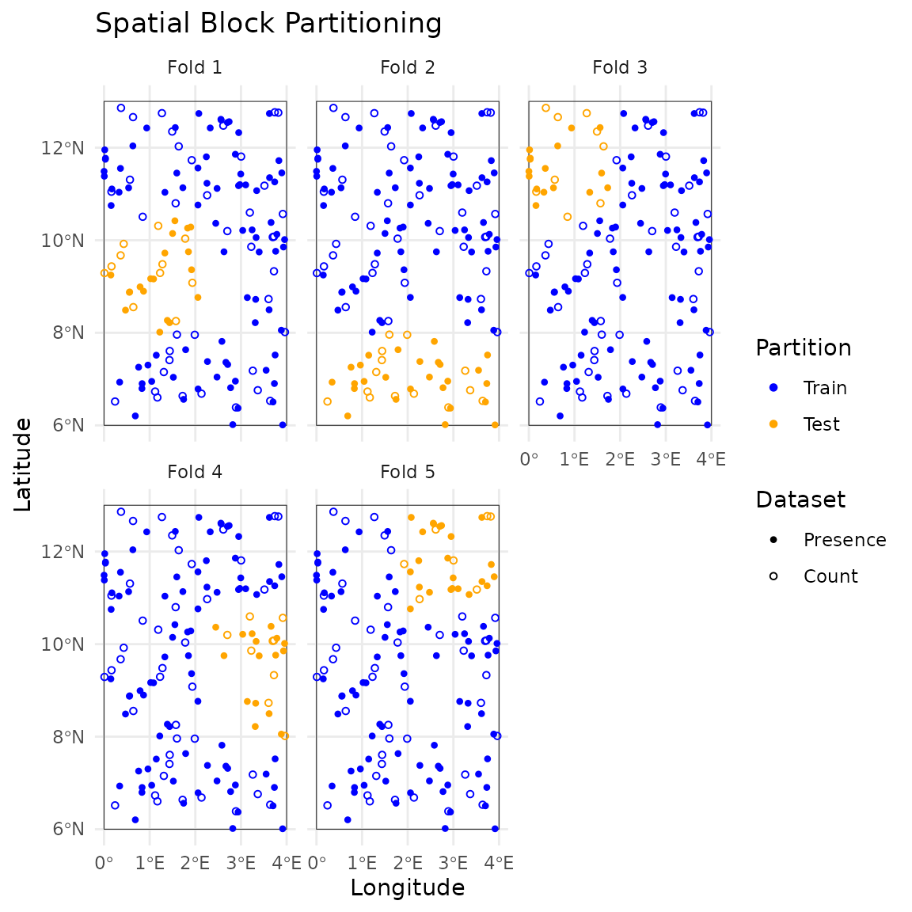
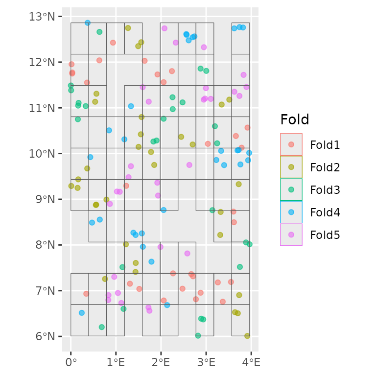
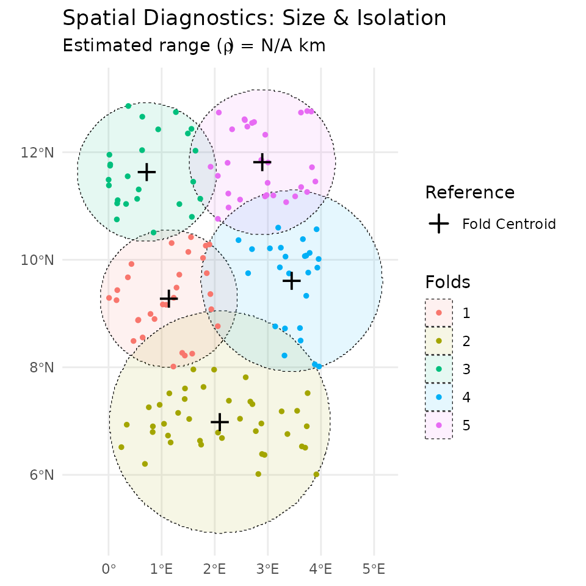
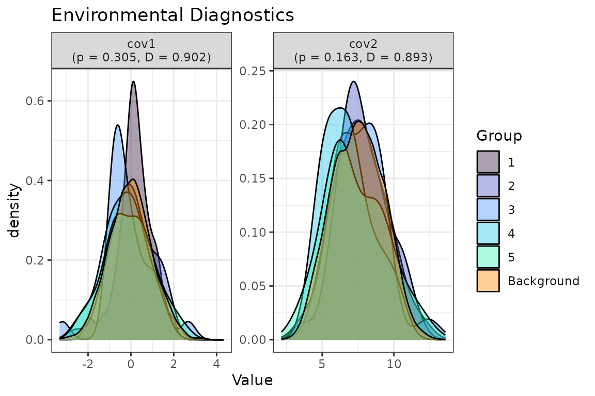

# Get started

``` r
library(isdmtools)
library(sf)
library(terra)
library(dplyr)
library(ggplot2)
```

## Introduction

This vignette should bridge the gap between “having spatial data” and
“being ready for modelling.” The fundamental philosophy of `isdmtools`
is to provide a standardised bridge between diverse biodiversity spatial
data sources and a robust spatial cross-validation (CV) strategy for
evaluating integrated species distribution models (ISDMs). This tutorial
will assist you through preparing data and generating spatial folds —
the essential first steps before fitting an Integrated Species
Distribution Model (ISDM).

## Data Preparation

### Step 1: Simulate some spatial data

Let’s consider a simple scenario by generating two spatial datasets
representing the presence and abundance of a given species over the
defined study area.

``` r
# Simulate a list of presence-only and count data
set.seed(42)
presence_data <- data.frame(
  x = runif(100, 0, 4), 
  y = runif(100, 6, 13), 
  site = rbinom(100, 1, 0.6)
) %>% st_as_sf(coords = c("x", "y"), crs = 4326)

count_data <- data.frame(
  x = runif(50, 0, 4), 
  y = runif(50, 6, 13), 
  count = rpois(50, 5)
) %>% st_as_sf(coords = c("x", "y"), crs = 4326)

datasets_list <- list(Presence = presence_data, Count = count_data)

# Define the study region (e.g. Benin's boundary rectangle)
ben_coords <- matrix(c(0, 6, 4, 6, 4, 13, 0, 13, 0, 6), ncol = 2, byrow = TRUE)
ben_sf <- st_sf(data.frame(name = "Region"), 
                          st_sfc(st_polygon(list(ben_coords)), 
                          crs = 4326))
                          
# Gnerate some continuous covariates
set.seed(42)
r   <- rast(ben_sf, nrow = 100, ncol = 100)
r[] <- rnorm(ncell(r))

rtmp   <- r
rtmp[] <- runif(ncell(r), 5, 10)

r <- c(r, rtmp + r)
names(r) <- c("cov1", "cov2")
```

### Step 2: Spatial Partitioning

Partitioning spatial data into spatial folds is important since it helps
reduce spatial autocorrelation in the observations and estimate a more
realistic model performance.

``` r
# Create the DataFolds object using the default method
folds <- create_folds(datasets_list, ben_sf, k = 5)
#>   train test
#> 1   120   30
#> 2   110   40
#> 3   125   25
#> 4   125   25
#> 5   120   30
#>  train test
#> 1   120   30
#> 2   110   40
#> 3   125   25
#> 4   125   25
#> 5   120   30
```

``` r
# Visualize the folds with custom styling
plot(folds, nrow = 1) +
  scale_x_continuous(breaks = seq(0, 4, 1)) +
  scale_y_continuous(breaks = seq(6, 13, 2)) +
  theme_minimal() +
  labs(title = "Spatial Block Partitioning")
```



``` r
# Create the DataFolds object using the `spatialsample` blocking engine
fold_ss <- create_folds(datasets_list, ben_sf, cv_method = "block")

# Using the native autoplot of `spatialesample`
ggplot2::autoplot(fold_ss)
```



``` r
# Folds summary
summary(fold_ss)
#> DataFolds Object Summary
#> ------------------------
#> Total observations: 150 
#> Number of folds (k): 5 
#> Datasets merged: Presence, Count 
#> 
#> Global Observations per Fold and Dataset:
#>      
#>       Presence Count Sum
#>   1         22     8  30
#>   2         18    14  32
#>   3         19     8  27
#>   4         16    15  31
#>   5         25     5  30
#>   Sum      100    50 150
#> 
#> Spatial Context: Study area polygon is defined (available for plotting).

#> DataFolds Object Summary
#> ------------------------
#> Total observations: 150 
#> Number of folds (k): 5 
#> Datasets merged: Presence, Count 
#>
#> Global Observations per Fold and Dataset:
#>    
#>     Presence Count Sum
#>  1         22     8  30
#>  2         18    14  32
#>  3         19     8  27
#>  4         16    15  31
#>  5         25     5  30
#> Sum      100    50 150
#>
#> Spatial Context: Study area polygon is defined (available for plotting).
```

### Step 3: Folds diagnostics

Various diagnostic analyses can be performed on the folds created in the
previous step. Specifically, when there is prior information on the
spatial range from an exploratory analysis, this value can be used as
the `rho` argument to the `check_folds` function. This can then be used
to compare to the estimated internal size and inter-block gap. The same
procedure is applied to post-modelling analysis to check if the
posterior range estimated aligns with the spatial geometry of the
specified folds or blocks.

``` r
# Check spatial independence of folds
geo_diag <- check_folds(folds, plot = TRUE)
print(geo_diag)
#> 
#> === isdmtools: Spatial Fold Diagnostic ===
#> 
#> Internal Size (Max Distance to Fold Centroid):
#>    Min. 1st Qu.  Median    Mean 3rd Qu.    Max. 
#>   140.6   141.7   148.5   169.0   185.9   228.1 
#> 
#> Inter-block Gap (Min Distance to Nearest Fold):
#>    Min. 1st Qu.  Median    Mean 3rd Qu.    Max. 
#>   32.71   32.71   42.08   41.62   45.42   55.16 
#> ==========================================

# Plot results
plot(geo_diag) 
```



``` r

#> === isdmtools: Spatial Fold Diagnostic ===
#>
#> Internal Size (Max Distance to Fold Centroid):
#>  Min. 1st Qu.  Median    Mean 3rd Qu.    Max. 
#>  140.6   141.7   148.5   169.0   185.9   228.1 
#>
#> Inter-block Gap (Min Distance to Nearest Fold):
#>   Min. 1st Qu.  Median    Mean 3rd Qu.    Max. 
#>  32.71   32.71   42.08   41.62   45.42   55.16 
#> =============================================
```

``` r
# Check environmental balance of folds
set.seed(42)  # for background sample reproducibility
env_diag <- check_env_balance(folds,
                              covariates = r,
                              n_background = 5000
                              )
print(env_diag)
#> 
#> === isdmtools: Environmental Balance Diagnostic ===
#> Significance (p > 0.05 = Balanced)
#> Overlap (D > 0.6 = Representative)
#> 
#>  Variable       Type  p_val Schoener_D
#>      cov1 Continuous 0.3053      0.902
#>      cov2 Continuous 0.1631      0.893
#> ==================================================

#> === isdmtools: Environmental Balance Diagnostic ===
#> Significance (p > 0.05 = Balanced)
#> Overlap (D > 0.6 = Representative)
#>
#> Variable       Type  p_val Schoener_D
#>     cov1 Continuous 0.3053      0.902
#>     cov2 Continuous 0.1631      0.893
#> ===================================================
```

``` r
# Plot outputs
plot(env_diag)
```



``` r
# Combined diagnostics
summarise_fold_diagnostics(geo_diag, env_diag)
#> 
#> ==========================================
#>    isdmtools: INTEGRATED FOLD SUMMARY     
#> ==========================================
#> 
#>         Domain                     Metric   Value    Status
#>     Geographic Avg Internal Distance (km) 168.970 Separated
#>     Geographic    Avg Inter-Fold Gap (km)  41.617 Separated
#>  Environmental         Median Overlap (D)   0.897  Balanced
#>  Environmental            Minimum p-value   0.163  Balanced
#> 
#> ------------------------------------------
#> CONCLUSION: Folds are spatially independent 
#> and environmentally representative.
#> ==========================================

#> ==========================================
#>   isdmtools: INTEGRATED FOLD SUMMARY     
#> ==========================================
#>
#>        Domain                     Metric   Value    Status
#>    Geographic Avg Internal Distance (km) 168.970 Separated
#>    Geographic    Avg Inter-Fold Gap (km)  41.617 Separated
#> Environmental         Median Overlap (D)   0.897  Balanced
#> Environmental            Minimum p-value   0.163  Balanced
#>
#> ------------------------------------------
#> CONCLUSION: Folds are spatially independent 
#> and environmentally representative.
#> ==========================================
```

### Step 4: Data Extraction for Modelling

Once spatial folds are created, one can extract the data and see how it
looks like right before it goes into a modelling tool like inlabru. You
can access both ‘train’ and ‘test’ sets and their corresponding datasets
as follows:

``` r
# Extract fold 1
splits_1 <- extract_fold(folds, fold = 1)

# Accessing the training and testing sets for the "Presence" source
head(splits_1$train$Presence)
#> Simple feature collection with 6 features and 1 field
#> Geometry type: POINT
#> Dimension:     XY
#> Bounding box:  xmin: 1.144558 ymin: 7.515971 xmax: 3.748302 ymax: 12.73826
#> Geodetic CRS:  WGS 84
#>   site                  geometry
#> 1    0 POINT (3.659224 10.38372)
#> 2    1 POINT (3.748302 7.520104)
#> 3    0 POINT (1.144558 7.515971)
#> 4    1 POINT (3.321791 8.722615)
#> 5    1 POINT (2.566982 12.59719)
#> 6    1 POINT (2.076384 12.73826)
head(splits_1$test$Presence)
#> Simple feature collection with 6 features and 1 field
#> Geometry type: POINT
#> Dimension:     XY
#> Bounding box:  xmin: 0.4699494 ymin: 8.489662 xmax: 1.899988 ymax: 10.28493
#> Geodetic CRS:  WGS 84
#>   site                   geometry
#> 1    1  POINT (1.830967 10.26256)
#> 2    1  POINT (1.021715 9.169121)
#> 3    1   POINT (1.849171 9.75053)
#> 4    1 POINT (0.4699494 8.489662)
#> 5    1  POINT (1.899988 10.28493)
#> 6    1 POINT (0.5548407 8.874446)
```

## Conclusion

Congratulations! You have successfully fused multi-source biodiversity
data and generated spatially independent partitions for robust model
validation. By using
[`create_folds()`](https://sodeidelphonse.github.io/isdmtools/reference/create_folds.md)
and related folds’ diagnostic tools, you’ve ensured that your model
evaluation will account for spatial autocorrelation, providing a more
realistic estimate of predictive performance.

The `isdmtools` journey continues with model fitting and comprehensive
evaluation. Depending on your needs, we recommend the following paths:

- *Model Fitting*: Use the training data extracted via
  [`extract_fold()`](https://sodeidelphonse.github.io/isdmtools/reference/DataFolds-methods.md)
  to fit your models using modelling engines like inlabru, PointedSDMs,
  or standard GAMs tools which can support spatial data with multiple
  response formats.
- *Integrated Evaluation*: One predictions are obtained, evaluate the
  models and analyse the outputs.

The advanced guide on [ISDM Evaluation
Workflow](https://sodeidelphonse.github.io/isdmtools/articles/isdm-evaluation-workflow.md)
covers model building with external tools, calculation of
dataset-specific and composite scores, suitability analysis and mapping
with `isdmtools`
