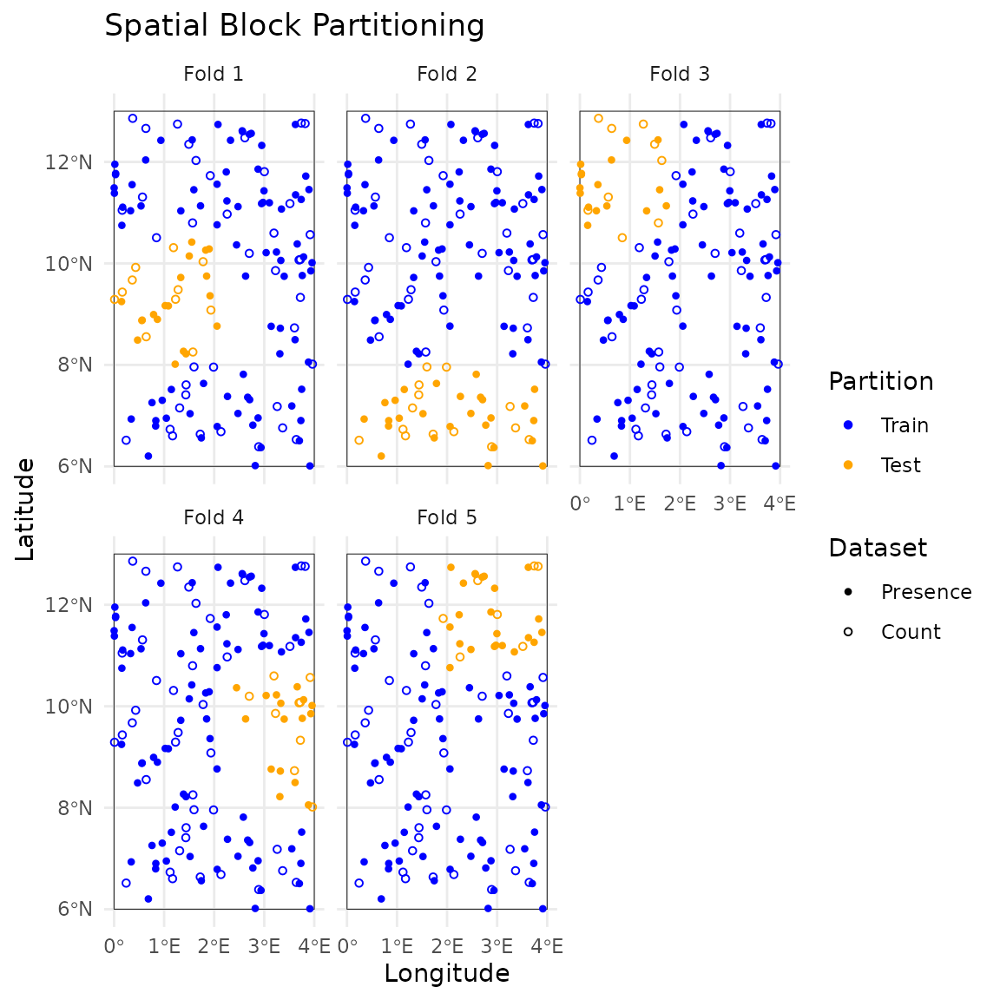
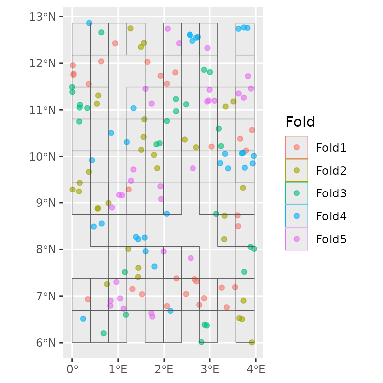
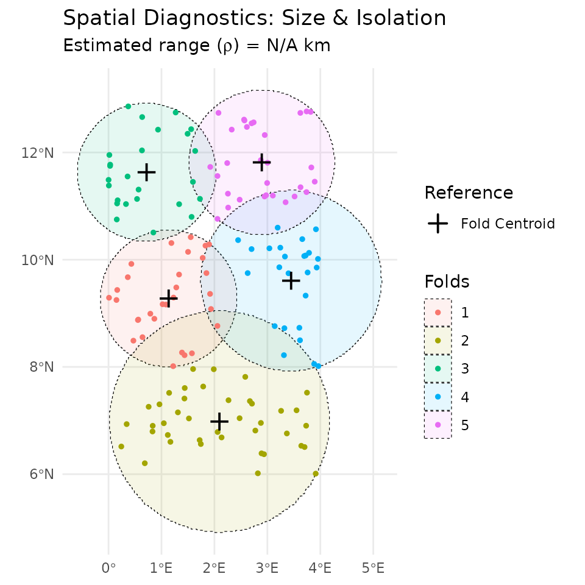
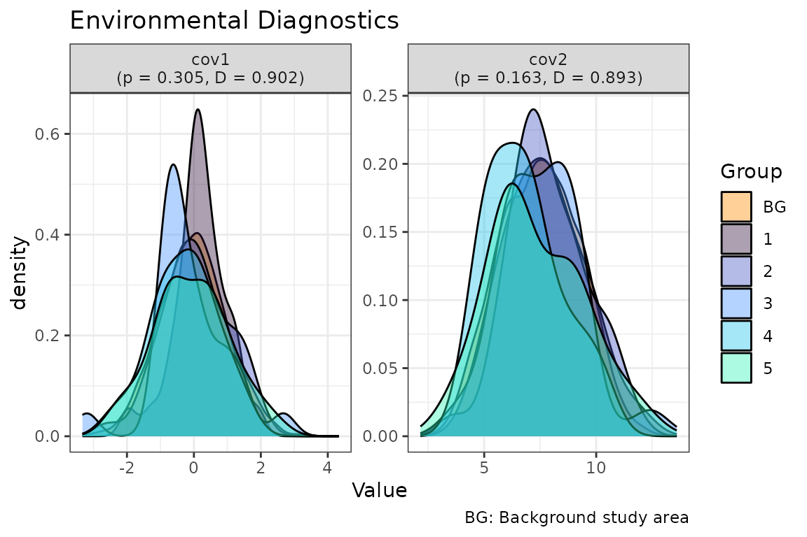
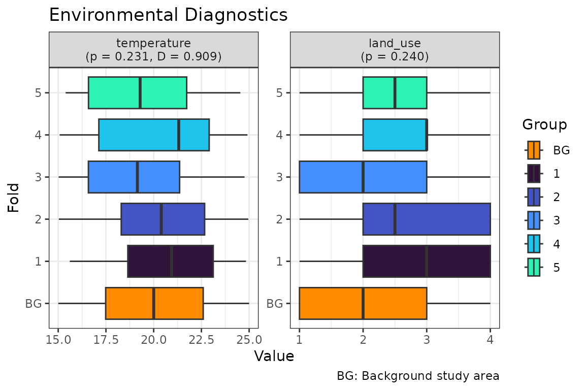

# Get started with isdmtools

``` r
library(isdmtools)
library(sf)
library(terra)
library(dplyr)
library(ggplot2)
```

## Introduction

The integrated species distribution modelling (ISDM) is any statistical
approach that combine biodiversity data from different sampling schemes
with the purpose of correcting for biases or providing an overall
estimation of the species distribution based on multisource evidence.
This vignette should bridge the gap between “having spatial data” and
“being ready for modelling.” The fundamental philosophy of `isdmtools`
is to provide a standardised bridge between diverse biodiversity spatial
data sources and a robust spatial cross-validation (CV) strategy for
evaluating integrated species distribution models (ISDMs). This tutorial
will assist you through preparing data and generating spatial folds —
the essential first steps before fitting an Integrated Species
Distribution Model (ISDM).

## Data Preparation

Let’s consider a simple scenario by generating two spatial datasets
representing the presence and abundance of a given species within a
designated study region. The purpose of this tutorial is to provide a
simple introduction to the tool, as opposed to addressing a very complex
scenario of spatially autocorreleted datasets.

``` r
# Simulate a list of presence-only and count data
set.seed(42)
presence_data <- data.frame(
  x = runif(100, 0, 4),
  y = runif(100, 6, 13),
  site = rbinom(100, 1, 0.6)
) |> st_as_sf(coords = c("x", "y"), crs = 4326)

count_data <- data.frame(
  x = runif(50, 0, 4),
  y = runif(50, 6, 13),
  count = rpois(50, 5)
) |> st_as_sf(coords = c("x", "y"), crs = 4326)

datasets_list <- list(Presence = presence_data, Count = count_data)

# Define the study region (e.g. Benin's boundary rectangle)
ben_coords <- matrix(c(0, 6, 4, 6, 4, 13, 0, 13, 0, 6), ncol = 2, byrow = TRUE)
ben_sf <- st_sf(
  data.frame(name = "Region"),
  st_sfc(st_polygon(list(ben_coords)),
    crs = 4326
  )
)

# Generate some continuous covariates
set.seed(42)
r <- rast(ben_sf, nrow = 100, ncol = 100)
r[] <- rnorm(ncell(r))
rtmp <- r
rtmp[] <- runif(ncell(r), 5, 10)

r <- c(r, rtmp + r)
names(r) <- c("cov1", "cov2")
```

## Spatial Data Partitioning

The partitioning of spatial data into spatial folds is a crucial step in
the process of model evaluation via blocked cross-validation, as it
assists in the reduction of spatial autocorrelation in the observations.
This, in turn, enables the estimation of a more realistic model
performance. In the following code chunks, we illustrate with
`isdmtools` two distinct blocking schemes for the purpose of resampling
the observed spatial data (Valavi et al. 2018; Mahoney et al. 2023).

``` r
# Create the DataFolds object using the default method
folds <- create_folds(datasets_list, ben_sf, cv_method = "cluster")
#>   train test
#> 1   120   30
#> 2   110   40
#> 3   125   25
#> 4   125   25
#> 5   120   30
```

``` r
# Visualize the folds with custom styling
plot(folds, nrow = 2, annotate = FALSE) +
  scale_x_continuous(breaks = seq(0, 4, 1)) +
  scale_y_continuous(breaks = seq(6, 13, 2)) +
  theme_minimal() +
  labs(title = "Spatial Block Partitioning")
```



``` r
# Create the DataFolds object using the `spatialsample` blocking engine
fold_ss <- create_folds(datasets_list, ben_sf, cv_method = "block")

# Using the native autoplot of `spatialesample` which shows only pooled data
ggplot2::autoplot(fold_ss)
```



``` r
# Folds summary
summary(fold_ss)
#> DataFolds Object Summary
#> ------------------------
#> Total observations: 150 
#> Number of folds (k): 5 
#> Datasets merged: Presence, Count 
#> 
#> Global Observations per Fold and Dataset:
#>      
#>       Presence Count Sum
#>   1         22     8  30
#>   2         18    14  32
#>   3         19     8  27
#>   4         16    15  31
#>   5         25     5  30
#>   Sum      100    50 150
#> 
#> Spatial Context: Study area polygon is defined (available for plotting).
```

## Folds Diagnostics

The `isdmtools` package has introduced various *diagnostic tools* to
perform supplementary analyses on the quality of the spatial folds (or
blocks) that were created in the previous step. We distinguish between
diagnostics in geographical and environmental spaces as well as combined
analyses. The *geographical fold diagnostics* are performed using the
[`check_folds()`](https://sodeidelphonse.github.io/isdmtools/reference/check_folds.md)
method while the *environmental fold diagnostic* is achieved via the
[`check_env_balance()`](https://sodeidelphonse.github.io/isdmtools/reference/check_env_balance.md)
method. Depending on the spatial blocking strategy used for data
partitioning, both diagnostic analyses can be combined into a unified
framework. The following sections introduces how diagnostic tools can be
used to assess the validity of spatial folds generated from mutisource
data for blocked cross-validation.

- **Folds diagnostics in geographical space**

This *diagnostic strategy* compute the maximum Euclidean distance
between points with respect to the fold centroid on the one hand
(i.e. the internal size) and the minimum distance between points within
a specific fold with its nearest fold (i.e. the inter-block gap) on the
other hand.

``` r
# Check spatial independence of folds using the default rho (N/A)
geo_diag <- check_folds(folds, plot = TRUE)
print(geo_diag)
#> 
#> === isdmtools: Spatial Fold Diagnostic ===
#> 
#> Internal Size (Max Distance to Fold Centroid):
#>    Min. 1st Qu.  Median    Mean 3rd Qu.    Max. 
#>   140.6   141.7   148.5   169.0   185.9   228.1 
#> 
#> Inter-block Gap (Min Distance to Nearest Fold):
#>    Min. 1st Qu.  Median    Mean 3rd Qu.    Max. 
#>   32.71   32.71   42.08   41.62   45.42   55.16 
#> ==========================================

# Plot results
plot(geo_diag)
```



As the results illustrates, the inter-block gap is approximately 42 km
in average. This indicates that there is no contiguous spatial folds
from the selected blocking strategy, thereby supporting the hypothesis
of no *block leakage*.

In the context of *geographical fold diagnostics*, should any prior
information on the spatial range be available from an exploratory
analysis, this can be used for the `rho` argument of the
[`check_folds()`](https://sodeidelphonse.github.io/isdmtools/reference/check_folds.md)’
method. This value can then be compared to the calculated inter-fold gap
in order to ascertain whether folds are independent. For instance, the
[`blockCV::cv_spatial_autocor()`](https://rdrr.io/pkg/blockCV/man/cv_spatial_autocor.html)
function can help derive prior information on the spatial range (Valavi
et al. 2018). Additionally, if the correlation function is part of
*Matérn* family, the helper function
[`solve_practical_range()`](https://sodeidelphonse.github.io/isdmtools/reference/solve_practical_range.md)
from our `isdmtools` package can be utilised to derive the corresponding
*practical range* required for spatial diagnostics (see Sode et al.
(2025) for further details). The same procedure can be applied to a
Bayesian analysis to check if the *posterior practical range* estimated
aligns with the spatial geometry of the specified folds.

- **Folds diagnostics in the environmental space**

Another crucial aspect of blocked cross-validation strategy is to ensure
that validation metrics reflect the integrated model’s ability to
generalise across the species’ niche, rather than its proximity to
training data. The analysis of spatial folds in the environmental space
can allow this hypothesis to be assessed as nearly met before proceeding
with the modelling process.

``` r
# Check environmental balance of folds
set.seed(42) # set this for background sample reproducibility
env_diag <- check_env_balance(folds,
  covariates = r,
  n_background = 5000
)
print(env_diag)
#> 
#> === isdmtools: Environmental Balance Diagnostic ===
#> Significance (p > 0.05 = Balanced)
#> Overlap (D > 0.6 = Representative)
#> 
#>  Variable       Type  p_val Schoener_D
#>      cov1 Continuous 0.3053      0.902
#>      cov2 Continuous 0.1631      0.893
#> ==================================================
```

``` r
# Plot outputs
plot(env_diag)
```



As illustrated by the outputs, the *Schoener D* metric is greater than
0.6 for both covariates. This indicates that spatial folds exhibit
significant overlap with the background area. Additionally, the p-value
resulting from comparing the median values of the variables across the
folds is greater than 0.05. This suggests that the environmental
variables do not differ significantly between the blocks. Consequently,
it can be hypothesised that the spatial blocks are environmentally
representative and may be robust for the integrated model prediction and
generalisation.

- **Combined analysis**

It is possible to combine both types of fold diagnostics in order to
draw a unified conclusion. However, it should be noted that the
applicability of both diagnostic tools is not universal across all the
spatial blocking strategies covered in the package. Therefore, the most
appropriate block diagnostic tool may be contingent on the selected
blocking scheme and the geometry of resulting folds.

``` r
# Combined diagnostics
summarise_fold_diagnostics(geo_diag, env_diag)
#> 
#> ==========================================
#>    isdmtools: INTEGRATED FOLD SUMMARY     
#> ==========================================
#> 
#>         Domain                     Metric   Value    Status
#>     Geographic Avg Internal Distance (km) 168.970 Separated
#>     Geographic    Avg Inter-Fold Gap (km)  41.617 Separated
#>  Environmental         Median Overlap (D)   0.897  Balanced
#>  Environmental            Minimum p-value   0.163  Balanced
#> 
#> ------------------------------------------
#> CONCLUSION: Folds are spatially independent 
#> and environmentally representative.
#> ==========================================
```

- **Mixture of continuous and categorical variables**

In practical application, we may have a mixture of continuous and
categorical covariates (e.g. land cover). In this scenario, the
*Schoener D* metric cannot be calculated for the categorical variables.
The p-value for this type of variable is then derived from the
Chi-square test based on the Monte Carlo approximation instead of the
Kruskal Wallis test used for the continuous variables.

``` r
# Continuous (temperature) and categorical (land cover) variables
set.seed(42)

r_temp <- rast(ben_sf, nrow = 100, ncol = 100, val = runif(10000, 15, 25))
r_land <- rast(ben_sf, nrow = 100, ncol = 100, val = sample(1:4, 10000, TRUE))
levels(r_land) <- data.frame(ID = 1:4, cover = c("Forest", "Grass", "Urban", "Water"))
env_stack <- c(r_temp, r_land)
names(env_stack) <- c("temperature", "land_use")

# Run the test with 5000 background cells and use boxplot
env_mixed <- check_env_balance(
  folds,
  covariates = env_stack,
  n_background = 5000,
  plot_type = "boxplot"
)

print(env_mixed)
#> 
#> === isdmtools: Environmental Balance Diagnostic ===
#> Significance (p > 0.05 = Balanced)
#> Overlap (D > 0.6 = Representative)
#> 
#>     Variable        Type  p_val Schoener_D
#>  temperature  Continuous 0.2311      0.909
#>     land_use Categorical 0.2399         NA
#> ==================================================
```

``` r
# Plot outputs
plot(env_mixed)
```



``` r
# Combined diagnostics
summarise_fold_diagnostics(geo_diag, env_mixed)
#> 
#> ==========================================
#>    isdmtools: INTEGRATED FOLD SUMMARY     
#> ==========================================
#> 
#>         Domain                     Metric   Value    Status
#>     Geographic Avg Internal Distance (km) 168.970 Separated
#>     Geographic    Avg Inter-Fold Gap (km)  41.617 Separated
#>  Environmental         Median Overlap (D)   0.909  Balanced
#>  Environmental            Minimum p-value   0.231  Balanced
#> 
#> ------------------------------------------
#> CONCLUSION: Folds are spatially independent 
#> and environmentally representative.
#> ==========================================
```

## Data Extraction for Modelling

Once spatial folds are created, one can extract the data and see how it
looks like right before it goes into an integrated modelling tool. You
can access both ‘train’ and ‘test’ sets and their corresponding datasets
as follows:

``` r
# Extract fold 1
splits_1 <- extract_fold(folds, fold = 1)

# Accessing the training and testing sets for the "Presence" source
head(splits_1$train$Presence)
#> Simple feature collection with 6 features and 1 field
#> Geometry type: POINT
#> Dimension:     XY
#> Bounding box:  xmin: 1.144558 ymin: 7.515971 xmax: 3.748302 ymax: 12.73826
#> Geodetic CRS:  WGS 84
#>   site                  geometry
#> 1    0 POINT (3.659224 10.38372)
#> 2    1 POINT (3.748302 7.520104)
#> 3    0 POINT (1.144558 7.515971)
#> 4    1 POINT (3.321791 8.722615)
#> 5    1 POINT (2.566982 12.59719)
#> 6    1 POINT (2.076384 12.73826)

head(splits_1$test$Presence)
#> Simple feature collection with 6 features and 1 field
#> Geometry type: POINT
#> Dimension:     XY
#> Bounding box:  xmin: 0.4699494 ymin: 8.489662 xmax: 1.899988 ymax: 10.28493
#> Geodetic CRS:  WGS 84
#>   site                   geometry
#> 1    1  POINT (1.830967 10.26256)
#> 2    1  POINT (1.021715 9.169121)
#> 3    1   POINT (1.849171 9.75053)
#> 4    1 POINT (0.4699494 8.489662)
#> 5    1  POINT (1.899988 10.28493)
#> 6    1 POINT (0.5548407 8.874446)
```

## Conclusion

Congratulations! You have successfully fused multi-source biodiversity
data and generated spatially independent partitions for robust model
validation. By using
[`create_folds()`](https://sodeidelphonse.github.io/isdmtools/reference/create_folds.md)
and appropriate folds’ diagnostic tools, you’ve ensured that your model
evaluation will account for spatial autocorrelation, providing a more
realistic estimate of predictive performance.

The `isdmtools` journey continues with model fitting and comprehensive
evaluation. Depending on your needs, we recommend the following paths:

- *Model Fitting*: Use the training data extracted via
  [`extract_fold()`](https://sodeidelphonse.github.io/isdmtools/reference/DataFolds-methods.md)
  to fit your models using modelling engines like inlabru, PointedSDMs,
  or standard generalised (additive) mixed models (GAMMs) tools which
  can support multisource spatial data.
- *Integrated Evaluation*: Once predictions are obtained, evaluate the
  models with the testing set and analyse the outputs.

The advanced guide on [ISDM Evaluation
Workflow](https://sodeidelphonse.github.io/isdmtools/articles/isdm-workflow.md)
covers model building with external tools, and the use of `isdmtools` to
perform model evaluation, suitability analysis and mapping.

## References

Mahoney, Michael J., Lucas K. Johnson, Julia Silge, Hannah Frick, Max
Kuhn, and Colin M. Beier. 2023. “Assessing the Performance of Spatial
Cross-Validation Approaches for Models of Spatially Structured Data.”
arXiv. <https://doi.org/10.48550/arXiv.2303.07334>.

Sode, A. Idelphonse, A. Belarmain Fandohan, Elias T. Krainski, Achille
E. Assogbadjo, and Romain Glèlè Kakaï. 2025. “Integrating Presence-only
and Abundance Data to Predict Baobab (Adansonia Digitata L.)
Distribution: A Bayesian Data Fusion Framework.” Preprint.
<https://doi.org/10.21203/rs.3.rs-7871875/v1>.

Valavi, Roozbeh, Jane Elith, José J. Lahoz-Monfort, and Gurutzeta
Guillera-Arroita. 2018. “blockCV: An R Package for Generating Spatially
or Environmentally Separated Folds for k-Fold Cross-Validation of
Species Distribution Models.” bioRxiv. <https://doi.org/10.1101/357798>.
